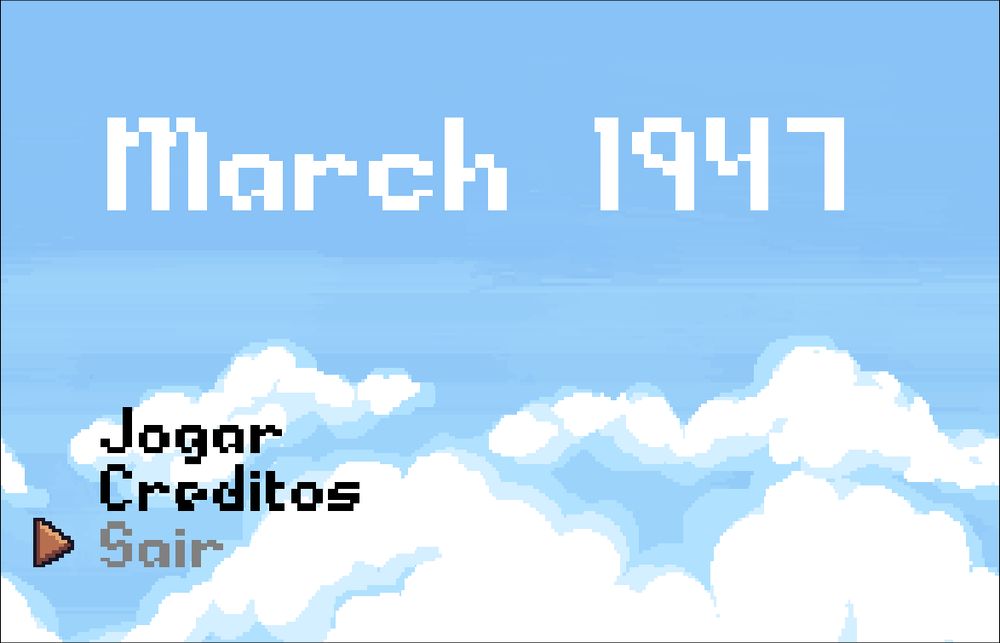
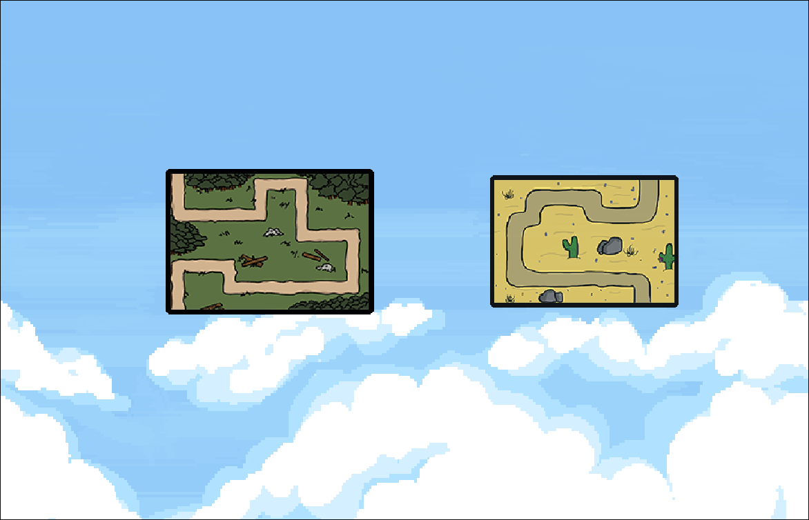
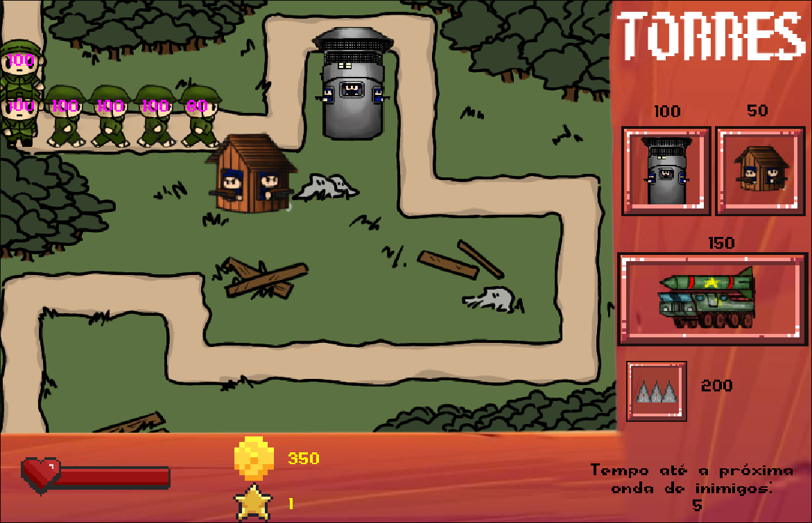
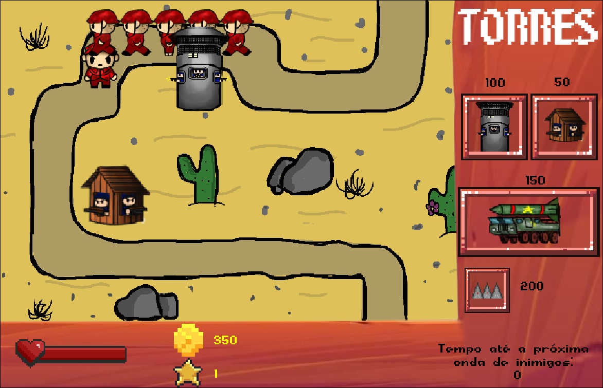

 <h1>March-1947</h1>
  

  

Este repositório foi montado como portifólio por um dos integrantes do projeto, <b>Eduardo</b>, com o intuito de demonstrar seu trabalho desempenhado na parte de <b>Programação</b>.

 
 

 
 

 
<h2>COMANDOS:</h2>
<ul>
 <li>Movimentação no menu: Setinhas e Espaço (Selecionar)</li>
 <li>Comprar e Vender Torres: Clique Esquerdo do Mouse e Clique Direito do Mouse, respectivamente</li>
 <li>Upgrade: CTRL Esquerdo e Clique Esquerdo do Mouse no ícone, para sair do modo upgrade pressione ESC</li>
</ul>

<h2>Apresentando o Projeto</h2>

Este projeto foi realizado para a SEMANA TÉCNICA de 2022 no Centro Estadual de Educação Profissional de Ponta Grossa, por toda turma 2ºA Informática. O projeto se trata de um Tower Defense com o tema de guerra fria.

As tecnologias usadas no desenvolvimento do projeo foram a Engine GameMaker Studio 2 e a linguagem de programação GML (GameMaker Language).

  
<h2>Feedback e Aprendizado</h2>

Com esse projeto aprendi a importância de se realizar documentação extensiva do código-fonte, bem como pensar em estratégias de modularização para melhor eficiência no desenvolvimento, a delegação de tarefas se mostrou crucuial para o andamento devido do projeto, de seus conceitos iniciais até a conclusão. A prática com a linguagem GML (baseada em C) foi um desafio devido sua abstração, mas superado com persistência e dedicação.

A paixão pelo desenvolvimento de jogos tomou forma em um projeto real, iniciar e terminar ciclos das etapas do projeto fortaleceu a vontade de completar todos seus desafios.

Sou grato a todas as pessoas que participaram diretamente do projeto, o esforço coletivo organizado sempre supera o individual.

  
<h2>Créditos</h2>
 <h3>2° A INFORMÁTICA</h3>
 <h4>Arte</h4>
<ul>
  <li>Anthony</li>
  <li>Gabriel</li>
  <li>Kailane</li>
  <li>Kaique</li>
  <li>Marcos</li>
  <li>Richard</li>
  <li>Marcos</li>
  <li>Matheus M</li>
</ul>

<h4>Programação</h4>
<ul>
  <li>Caio</li>
  <li>Carlos</li>
  <li>Eduardo</li>
  <li>Fernando</li>
</ul>

<h4>Organização</h4>
<ul>
  <li>Ana</li>
  <li>João</li>
  <li>Júlia B</li>
  <li>Júlia C</li>
  <li>Larissa</li>
  <li>Letícia</li>
  <li>Lorena</li>
  <li>Matheus P</li>
  <li>Michel</li>
  <li>Pablo</li>
  <li>Patrícia</li>
  <li>Rebeca</li>
  <li>Sibely</li>
  <li>Victor</li>
</ul>

<h4>Roteiro</h4>
<ul>
  <li>João</li>
  <li>John</li>
  <li>Michel</li>
</ul>

<h4>Professores</h4>
<ul>
  <li>Adenilson</li>
  <li>Jason</li>
  <li>Mirna</li>
</ul>
